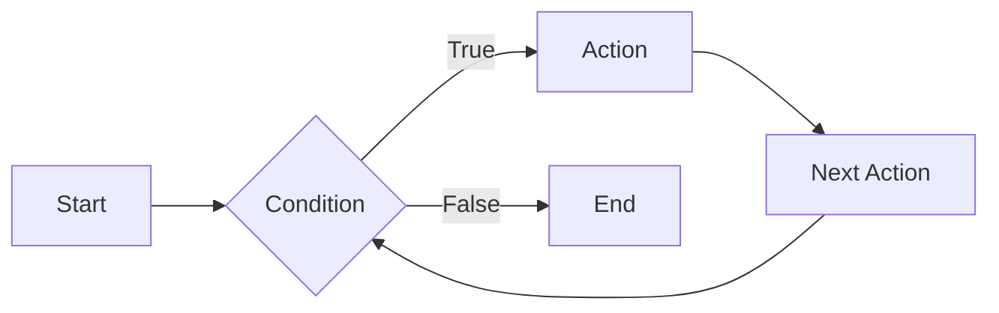
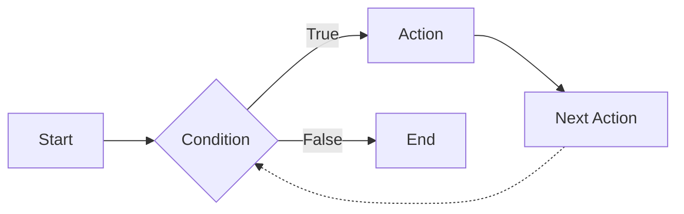

# Async Python Testing Tutorial

I've been working on some async code in Python recently, and I noticed that testing it is tricker than I suspected, so I thought I'd share my notes.

## Brief review of async

### What is async?

Asynchronous code, or async code, is code that runs in parallel with other code.  This is in contrast to synchronous code, which runs in sequence with other code.  In synchronous code, one line of code runs, then the next, then the next, and so on.  In asynchronous code, one line of code runs, then another line of code runs, then another line of code runs, and so on.  The difference is that in asynchronous code, the lines of code don't necessarily run in order.

This allows you to wait for results from something that may be running elsewhere, such as an API call or the result of a long running calculation, without stopping the rest of your code from running.

#### Synchonous code

#### Asynchronous code

The dotted line in the asynchronous code indicates that the code is not waiting for the result of the action before moving on to the next action.

### When do you need it?

You need async code when you have code that needs to wait for something to happen before it can continue.  For example, if you have a function that needs to wait for a response from an API call before it can continue, you need async code.  If you have a function that needs to wait for the result of a long running calculation before it can continue, you need async code.

Modern code is often asynchronous, because it alloww for scaling beyond the resourceds of a single system. For example, if you have a web server that needs to handle a large number of requests, you can use async code to handle each request in parallel, rather than waiting for each request to finish before starting the next one.

Machine learning tools often use async code, because they need to wait for the results of long running calculations before they can continue, or because they are using agents to run tasks in parallel. AutoGPT and Langchain are two examples of machine learning tools that use async code.

### How do you use it?

async_python_testing_tutorial
